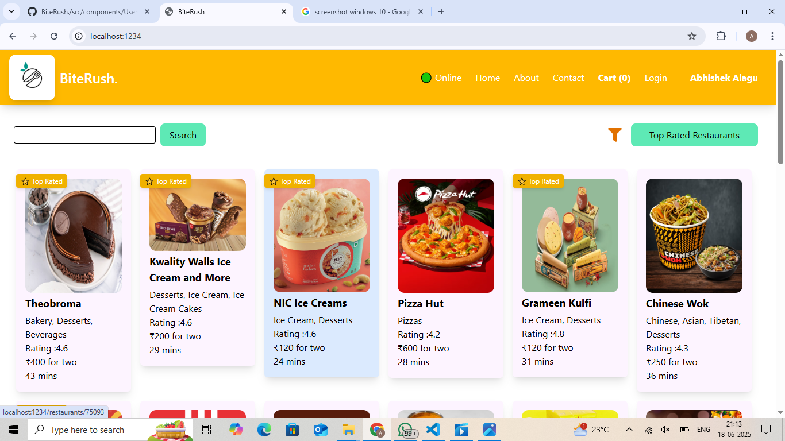
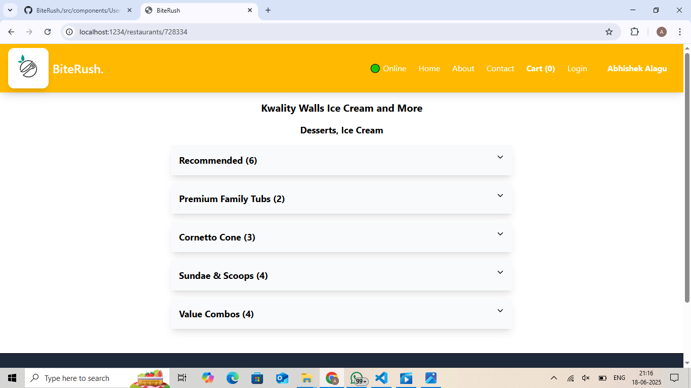

# 🍔 BiteRush - Food Ordering Web App

BiteRush is a modern, responsive food ordering web application built using React. It simulates an online food delivery experience with features like restaurant listing, menu browsing, cart management, checkout, and order confirmation — all powered by Swiggy's live API.

---

## 🚀 Live Demo

📂 [View the GitHub Repository](https://github.com/AbhishekAlagu/BiteRush)

---

## 📸 Screenshots

<!-- Add screenshots or GIFs if available -->



---

## 🛠 Tech Stack

- ⚛️ **React.js** – Component-based UI
- 🧠 **Redux Toolkit** – Cart state management
- 🌐 **React Router** – Dynamic routing
- 💅 **Tailwind CSS** – Utility-first responsive styling
- 🎥 **Framer Motion** – Smooth animations
- 🧩 **Custom Hooks & Context API** – Clean logic reuse
- 🌀 **Shimmer UI** – Better loading experience
- 🌍 **Swiggy API** – Real-time restaurant/menu data
- 💾 **localStorage** – Persistent cart data
- 🌐 **Netlify** – Deployed & hosted

---

## 📦 Features

- ✅ Browse top-rated restaurants with filters
- ✅ View dynamic restaurant menus from API
- ✅ Add/remove food items to cart
- ✅ Checkout form with validation
- ✅ Persistent cart using `localStorage`
- ✅ Order success simulation
- ✅ Mobile responsive design
- ✅ Error page for unknown routes
- ✅ Animations on scroll & transitions

---
## 📁 Project Structure

<pre> ``` REACT Project-1/ │ ├── .git/ ├── .parcel-cache/ ├── assets/ ├── dist/ ├── node_modules/ │ ├── src/ │ ├── components/ │ │ ├── About.js │ │ ├── Animation.js │ │ ├── Body.js │ │ ├── Cart.js │ │ ├── Checkout.js │ │ ├── Contact.js │ │ ├── Error.js │ │ ├── Footer.js │ │ ├── Header.js │ │ ├── Itemlist.js │ │ ├── Orderconfirmation.js │ │ ├── RestaurantCard.js │ │ ├── RestaurantCategory.js │ │ ├── RestaurantMenu.js │ │ ├── Shimmer.js │ │ ├── User.js │ │ └── UserClass.js │ │ │ ├── utils/ │ │ ├── appStore.js │ │ ├── cartSlice.js │ │ ├── constants.js │ │ ├── useOnlineStatus.js │ │ ├── useRestaurantMenu.js │ │ └── UserContext.js │ │ │ ├── App.js │ ├── index.css │ └── index.html │ ├── .gitignore ├── package.json ├── package-lock.json └── README.md ``` </pre>
---
## 🔧 Setup & Run Locally

1. Clone the repo  
   `git clone https://github.com/AbhishekAlagu/BiteRush.git`

2. Navigate to the project folder  
   `cd BiteRush`

3. Install dependencies  
   `npm install`

4. Start the dev server  
   `npm start`

---

## 📌 Note

> This project uses [Swiggy's public API](https://www.swiggy.com/) for fetching restaurant and menu data. It's built for learning purposes and UI simulation, not commercial use.
> 🚫 Note on Deployment
This project was not deployed due to CORS issues while trying to access Swiggy's public APIs.
I implemented multiple workarounds like:

Netlify serverless functions (/.netlify/functions)

CORS proxy services (e.g. corsproxy.io)

Despite these efforts, the API calls were consistently blocked because Swiggy does not offer a public or developer-friendly API.

💡 The project is fully functional locally, and you can test the core features such as:

Live restaurant menu fetching

Dynamic cart updates

Order confirmation page

I’ve documented the code thoroughly, and you are welcome to explore or extend the application further.
---

## 👨‍💻 Developer

**Abhishek Alagu**  
📧 [abhishekalagu@gmail.com]  
🔗 [LinkedIn](https://www.linkedin.com/in/your-profile)  
🐙 [GitHub](https://github.com/AbhishekAlagu)

---

## 💡 License

This project is licensed under the MIT License.  
Feel free to fork, contribute, or use it as a base for your own portfolio.

